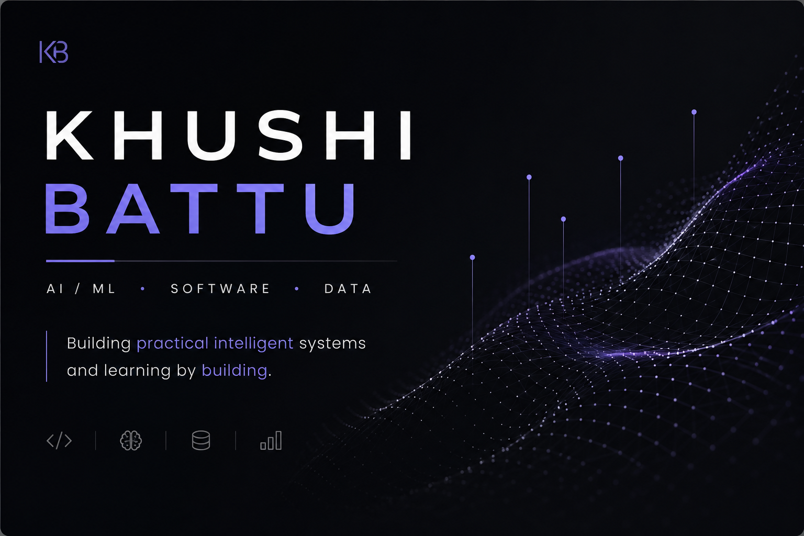

  

 

**AI/ML · SOFTWARE · DATA**

Building practical intelligent systems and learning by building.

---

## ABOUT

I'm an **AI/ML-focused developer** interested in Machine Learning, NLP, Data, and Software Engineering.

I enjoy turning ideas into working systems — experimenting with models, solving problems, building projects, and continuously improving my fundamentals.

---

## CURRENTLY

<table>
<tr>
<td width="33%" align="center">

### BUILDING

🧠 **HireSense AI**

AI-powered applications
Practical ML projects

</td>

<td width="33%" align="center">

### LEARNING

📚 **Machine Learning**

NLP · DSA
Software Engineering

</td>

<td width="33%" align="center">

### EXPLORING

🌐 **AI + Cloud**

Open Source
Deployment

</td>
</tr>
</table>

---

## FEATURED PROJECT

### 🧠 [HireSense AI](https://github.com/KhushiBattu/HireSense-AI-)

**AI-powered Resume Intelligence**

> Turning resumes and job descriptions into actionable career insights.

<table>
<tr>
<td width="60%">

**Capabilities**

* Resume parsing & skill extraction
* Resume–Job Description matching
* NLP-based semantic similarity
* Skill-gap analysis
* ATS resume scoring
* ML-based role prediction
* Career recommendations

</td>

<td width="40%">

**Stack**

`Python`
`NLP`
`Scikit-Learn`
`Pandas`
`NumPy`
`Streamlit`

 

**Flow**

`Resume` → `NLP` → `ML` → `Insights`

</td>
</tr>
</table>

**[View Repository →](https://github.com/KhushiBattu/HireSense-AI-)**

---

## OTHER PROJECTS

<table>
<tr>
<td width="50%">

### 🎙️ Voice AI Task Manager

Voice-enabled task management application using Python, Speech Recognition, and NLP.

**Python · NLP · Automation**

</td>

<td width="50%">

### 🏦 Banking Management System

Console-based banking system with account management, transactions, validation, and file handling.

**C++ · OOP · File Handling**

</td>
</tr>

<tr>
<td width="50%">

### 🧩 DSA Practice

Algorithmic problem solving focused on data structures, patterns, and efficient solutions.

**C++ · DSA**

</td>

<td width="50%">

### 🔬 Experiments & Learning

Smaller projects and experiments across programming, AI, data, and core computer science.

</td>
</tr>
</table>

---

## TECHNICAL STACK

**Languages**

`Python` · `C++` · `C` · `Java` · `SQL`

**AI / ML & Data**

`Machine Learning` · `NLP` · `Scikit-Learn` · `Pandas` · `NumPy`

**Development**

`Streamlit` · `Git` · `GitHub` · `VS Code`

**Core CS**

`DSA` · `OOP` · `DBMS` · `Operating Systems`

---

## GITHUB ACTIVITY

---

## PROOF OF WORK

<table>
<tr>
<td align="center" width="25%">

### 🥉

**SIH Internal Hackathon**

3rd Place

</td>

<td align="center" width="25%">

### 🧠

**AI Domain**

Infosys Springboard

</td>

<td align="center" width="25%">

### 📊

**Data Analytics**

Tata iQ · Forage

</td>

<td align="center" width="25%">

### ☁️

**Azure**

Data Fundamentals

</td>
</tr>
</table>

---

## LEADERSHIP

**ACM Student Chapter — AI/ML Lead**

Contributing to AI/ML activities and supporting project development within the student community.

**Placement Coordinator**

Supporting batch-level placement coordination, communication, and placement activities.

---

## WHAT I'M EXPLORING

`Machine Learning` · `NLP` · `Data Science` · `DSA` · `AI + Cloud` · `Open Source`

---

## ENGINEERING PHILOSOPHY

### Learn → Build → Break → Debug → Improve → Ship

 

Building practical systems. Learning continuously.

